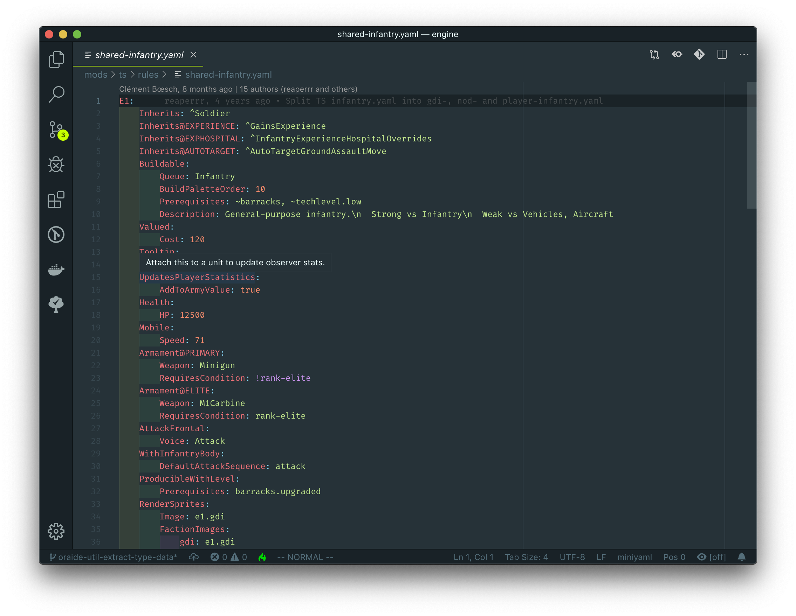

# `oraide`

A collection of tools with the aim of lowering the barrier to entry for
OpenRA-based game development.

## Screenshots

Hovering over a trait property on an actor

## License

See the [LICENSE](./LICENSE) file.

## Architecture

Read [./docs/dev/architecture.md](./docs/dev/architecture.md) for an overview of
the _OpenRA IDE_ project architecture (this does *not* cover LSP clients).

## Contact Us

You can find the maintainer as _Phrohdoh_ on [OpenRA's Discord
server](https://discord.openra.net).

Be sure to read and understand the server rules before participating.

Do know that the OpenRA IDE project (also called `oraide`) is an unofficial
project, so you should probably ping me directly in the `#off-topic` channel.

Please don't hesitate to reach out if you have
questions/comments/concerns/praise/whatever!