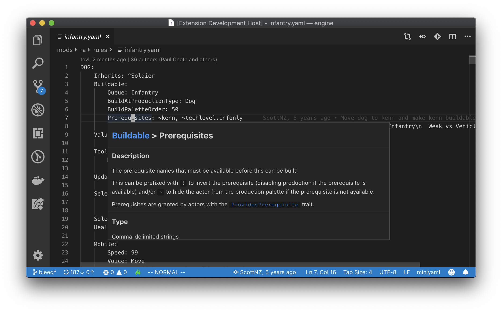

# `oraide`

A collection of tools with the aim of lowering the barrier to entry for OpenRA-based game development.

## Screenshots

Hovering over a trait property on an actor

## License

See the [LICENSE](./LICENSE) file.

## Terms to know

**OpenRA ([link](https://openra.net))**: An open-source ([GPLv3+](https://www.gnu.org/licenses/quick-guide-gplv3.html)) game engine implemented in [C#](https://docs.microsoft.com/en-us/dotnet/csharp/) on top of the [.NET Framework](https://en.wikipedia.org/wiki/.NET_Framework)

**MiniYaml**: OpenRA's custom configuration language which hijacked the `.yaml` extension (note: it **is not** valid [YAML](https://yaml.org/spec/1.2/spec.html))

**SDK ([link](https://github.com/OpenRA/OpenRAModSDK/))**: The official template for OpenRA-based games that comes bundled with utilitiy scripts

**LSP ([link](https://microsoft.github.io/language-server-protocol/specification))**: The _Language Server Protocol_ spearheaded by Microsoft

## General project structure

> NOTE: All docs in this repository are highly WIP and possibly out-dated

The `oraide` project is comprised of multiple components (some of which have dependencies on others).

| component | description |
|-|-|
| [oraide-span](./components/oraide-span/README.md) | A library that implements types for text &amp; file tracking |
| [oraide-actor](./components/oraide-actor/README.md) | A library that implements a primitive actor system |
| [oraide-query-system](./components/oraide-query-system/README.md) | A library that implements an on-demand, incremental computation system |
| [oraide-miniyaml](./components/oraide-miniyaml/README.md) | A library that converts MiniYaml text to trees |
| [oraide-sdk](./components/oraide-sdk/README.md) | A library that allows programmatic management of SDK-based projects |
| [oraide-language-server](./components/oraide-language-server/README.md) | A library that implements an LSP server |

## Architecture

Read [./docs/dev/architecture.md](./docs/dev/architecture.md) for an overview of the _OpenRA IDE_ project architecture (this does *not* cover LSP clients).

## Contact Us

You can find the maintainer as _Phrohdoh_ on [OpenRA's Discord server](https://discord.openra.net).

Be sure to read and understand the server rules before participating.

Do know that the OpenRA IDE project (also called `oraide`) is an unofficial project, so you should probably ping me directly in the `#off-topic` channel.

Please don't hesitate to reach out if you have questions/comments/concerns/praise/whatever!